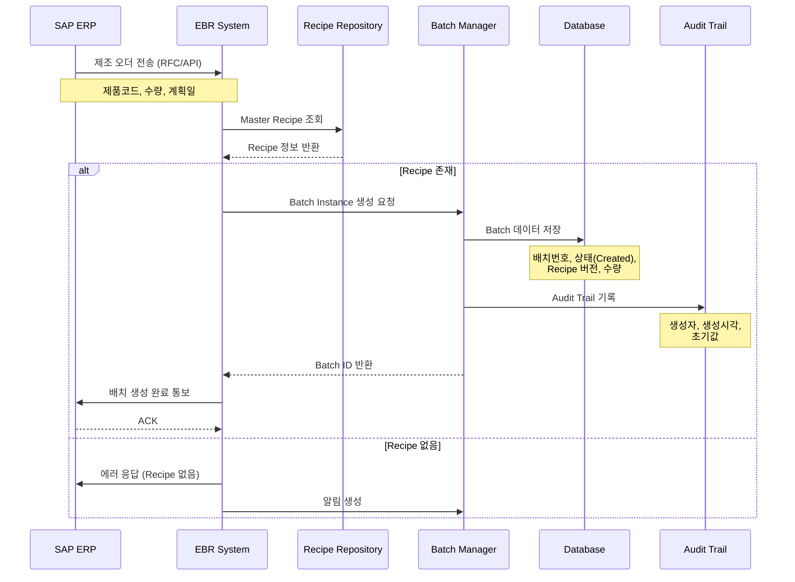
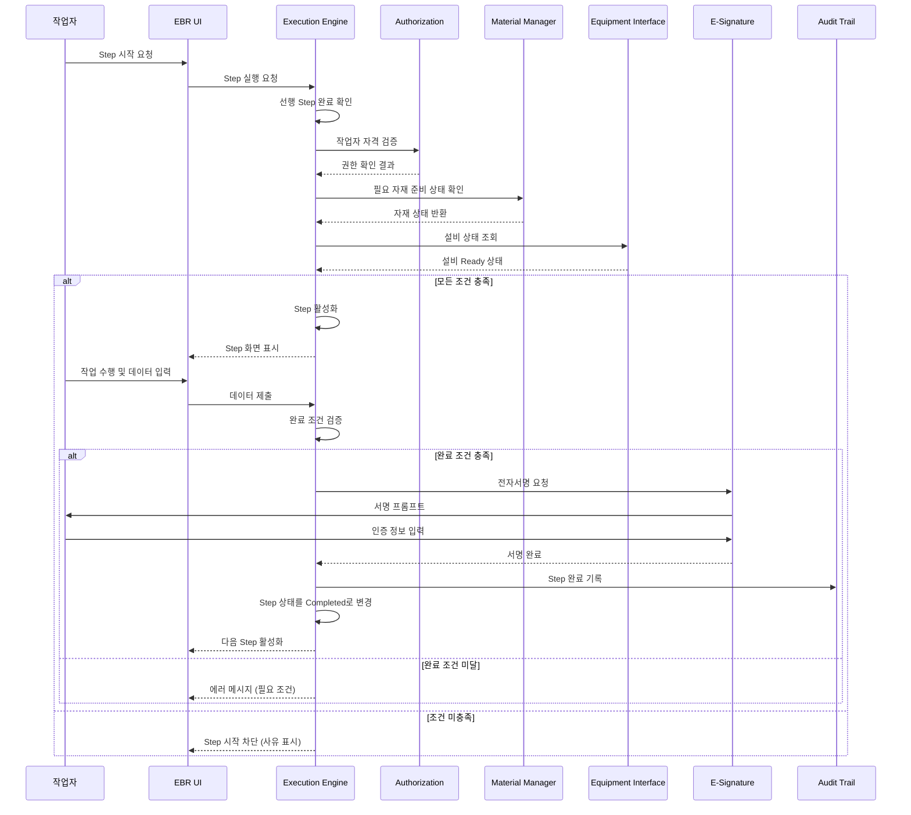

# EBR 프로젝트
**EBR**을 만든다는 것은, **규칙 기반 시스템**을 만드는 것과 같다.

제공할 기능

- 배치 & 레시피 관리: 어떤 제품을 어떤 절차로 만들 것인지를 정의
    - Master Recipe 정의 (공정, 단계, 파라미터)
    - 버전 관리 (레시피 변경 이력)
    - 배치 생성 (Recipe → Batch Instance)
    - 배치 상태 관리
- 공정 실행 통제 엔진: 사람이 아니라 시스템이 공정 순서를 강제
    - Step 순서 강제
    - 선행 조건 체크
        - 자재 준비
        - 설비 상태
        - 작업자 자격
    - Step 완료 조건 검증
    - Skip / Hold / Rework 제어

## 기술 스택

- **백엔드**: Spring Boot 3.5.9, Java 21, Gradle 8.0 이상
- **데이터베이스**: PostgreSQL
- **캐시/세션**: Redis
- **ORM**: JPA/Hibernate, QueryDSL
- **프론트엔드**: Thymeleaf 템플릿
- **보안**: Spring Security, JWT

## EBR 상세 프로세스

우리가 구현할 EBR 시스템은 어떻게 동작할까?

개략적인 대표 기능과 전체적인 흐름을 파악해야한다. (EBR 도메인 기능 외의 부가 기능은 일단 제외한다)

액션

1. 대표 기능을 개략적으로 정의한다.
2. 대표 기능 별 유스케이스를 정리한다. (액터 정의 필요)
3. 대표 기능 별 시퀀스 다이어그램을 정리한다.
4. 대표 기능과 연동되는 외부 기능을 정리한다. (SAP, ERP etc..)

---

## 대표 기능

1. 배치 생성 및 시작
2. 공정 단계 실행 및 통제
3. 자재 투입 및 검증
4. 공정 데이터 수집 
5. 규격 이탈 감지 및 처리
6. 전자서명 및 Audit Trail
7. 배치 리뷰 및 릴리즈

---

## 1. 배치 생성 및 시작 (SAP 연동)

### 유스케이스

- 액터: 생산 관리자, SAP 시스템
- 전제조건: Master Recipe가 시스템에 등록되어 있음. SAP에서 제조 오더가 생성됨
- 주요 흐름
    1. SAP에서 제조 오더 생성 (제품, 수량, 일정)
    2. EBR 시스템이 SAP로부터 제조 오더 정보 수신 (RFC/API)
    3. 제조 오더 기반으로 Master Recipe 선택
    4. Batch Instance 자동 생성 (배치 번호, 레시피 버전, 예상 수량)
    5. 초기 상태를 created로 설정
    6. SAP에 배치 생성 완료 통보 ~~(필요하다면)~~
- 관리자
    - 제조 관리자는 새롭게 생성된 배치 아이템들을 확인할 수 있어야 한다.
    - 정상적인 배치라고 판단될 경우, 제조 시작 승인 버튼으로 배치 상태를 RELEASED 할 수 있다.
    - Batch Status → RELEASED

### 시퀀스 다이어그램



## 2. 공정 단계 실행 및 통제

### 유스케이스

- 액터: 작업자, QA 담당자
- 전제조건: 배치가 생성되어 있다. 작업자가 해당 공정 수행 권한을 가진다.
- 주요 흐름
    1. 작업자가 현장에서 태블릿을 사용하여 진행가능한 배치 목록 확인
    2. 배치 선택 및 공정 시작 요청
    3. 시스템이 선행 조건 검증
        1. ~~필요 자재 준비 상태 (작업자 현장 검증)~~
        2. ~~설비 상태 (작업자 현장 검증)~~
        3. 작업자 자격 확인 (EBR 시스템 검증)
    4. 모든 조건 충족 시 배치 공정 Step 시작 
        1. Batch Status → IN_PROGRESS
    5. 작업자가 Step 내 작업 수행 (데이터 입력, 자재 투입 등)
        1. Step 1 - 원료 계량
        2. Step 2 - 자재 투입
        3. Step 3 - 공정 데이터 입력 (혼합 시간 입력)
        4. Step 완료 - 작업자 서명 (완료하시겠습니까?)
            
            ```json
            {
            	"user": "operator01",
            	"role": "OPERATOR",
            	"action": "STEP_COMPLETE"
            }
            ```
            
    6. 필요하다면 각 단계에 Supervisor 서명 추가
    7. 배치 완료 
        1. Batch Status → COMPLETE
- 관리자
    - 관리자는 각 Step 별 진행상태를 모니터링 할 수 있다.
    - 관리자는 각 Step에서 작업자가 입력한 데이터를 확인할 수 있다.
    - QA는 배치 Step을 리뷰할 수 있다.

### 시퀀스 다이어그램

