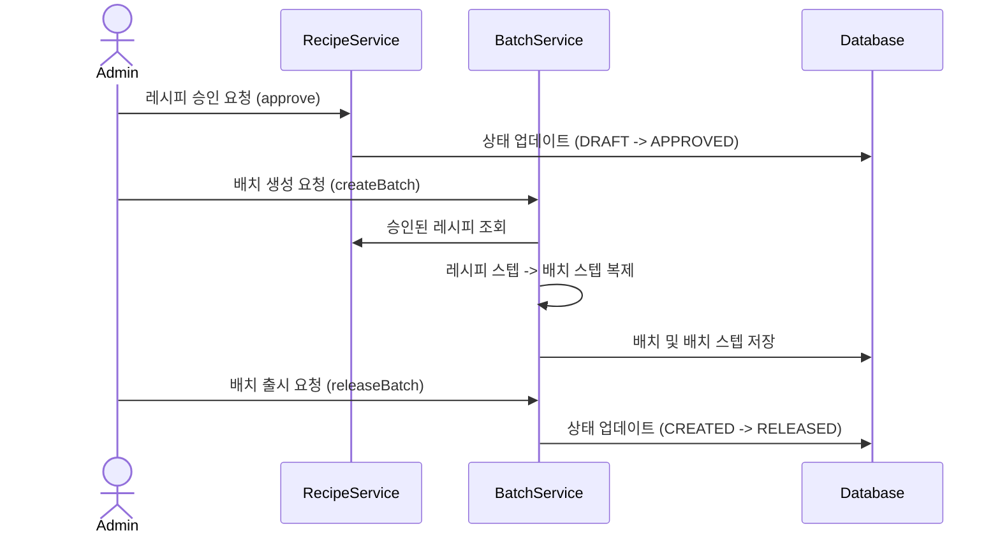
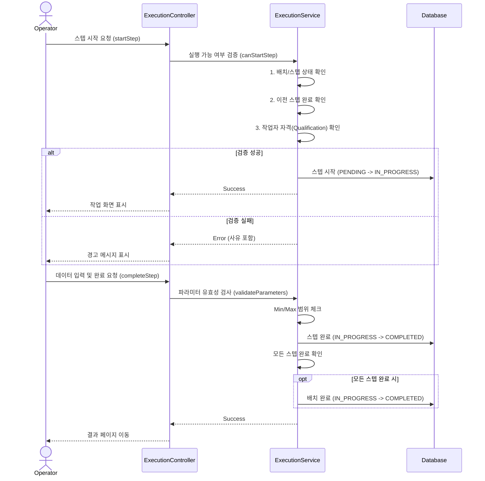
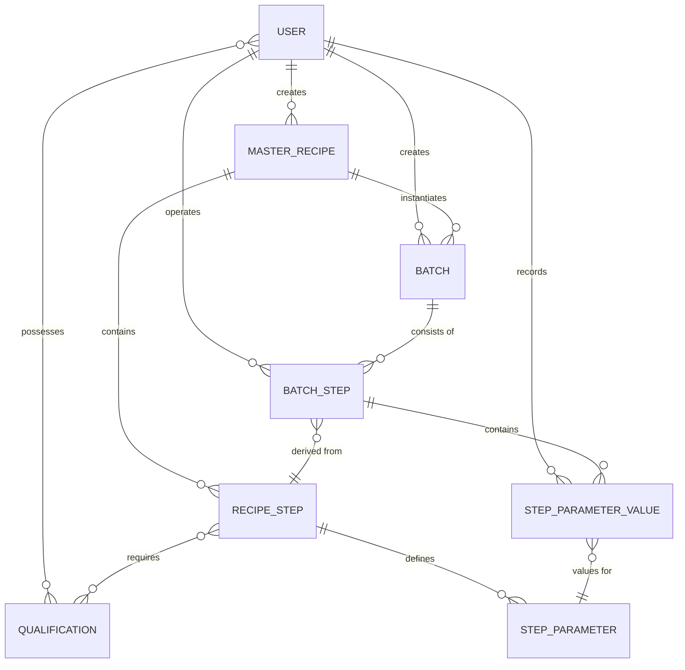

# EBR (Electronic Batch Record) MVP System

이 프로젝트는 제약 및 제조 공정에서 종이 기반의 기록서(Batch Record)를 디지털화하기 위한 **Electronic Batch Record (EBR)** 시스템의 MVP 버전입니다. 공정 레시피 관리, 제조 배치(Batch) 생성 및 실행, 작업자 자격 검증 등의 핵심 기능을 포함하고 있습니다.

## 1. 아키텍처 및 기술 스택

### 핵심 기술
- **Framework**: Spring Boot 3.2.0
- **Language**: Java 17
- **Database**: PostgreSQL (Docker 기반)
- **ORM**: Spring Data JPA (Hibernate)
- **Security**: Spring Security 6 (Form Login 기반 세션 인증)
- **View Engine**: Thymeleaf (레이아웃 다이얼렉트 사용)
- **Build Tool**: Gradle

### 아키텍처 구조
전형적인 **계층형 아키텍처(Layered Architecture)**를 따르고 있습니다:
1.  **Domain (Entity)**: 비즈니스 객체와 JPA 매핑 정보 (비즈니스 로직 포함)
2.  **Repository**: DB 접근 추상화 (Spring Data JPA)
3.  **Service**: 트랜잭션 경계 및 복합 비즈니스 로직 처리
4.  **Controller**: HTTP 요청 처리 및 뷰 렌더링 제어

---

## 2. 패키지 구성 및 역할

```text
biz.page1.ebr
├── config          # 시큐리티, 데이터 초기화 등 설정 클래스
├── controller      # 웹 MVC 컨트롤러
├── domain          # 핵심 도메인 모델 (Entities)
│   ├── batch       # 배치 실행 관련 (Batch, BatchStep)
│   ├── recipe      # 마스터 레시피 관련 (MasterRecipe, RecipeStep)
│   └── user        # 사용자 및 권한/자격 (User, Qualification)
├── repository      # JPA 리포지토리 인터페이스
├── security        # 스프링 시큐리티 상세 구현 (UserDetails)
└── service         # 비즈니스 로직 (Service Layer)
```

---

## 3. 핵심 도메인 모델 및 개념

### 3.1. User & Qualification (사용자 및 자격)
- **User**: 시스템 사용자. `ADMIN`, `SUPERVISOR`, `OPERATOR`의 3가지 역할을 가집니다.
- **Qualification**: 특정 공정을 수행하기 위한 전문 자격(예: 칭량, 혼합). 작업자(Operator)는 여러 자격을 보유할 수 있으며, 스텝 실행 시 이를 검증합니다.

### 3.2. Master Recipe (공정 표준)
- **MasterRecipe**: 제품 생산을 위한 표준 설계도입니다. `DRAFT` 상태에서 작성되며 `APPROVED` 되어야 실제 배치를 생성할 수 있습니다.
- **RecipeStep**: 공정의 개별 단계입니다. 각 단계는 **필수 자격 요건**과 **기록 파라미터**를 가집니다.
- **StepParameter**: 각 단계에서 기록해야 하는 항목(온도, 무게 등)과 그 허용 범위(Min/Max)를 정의합니다.

### 3.3. Batch (제조 실행)
- **Batch**: 마스터 레시피를 기반으로 생성된 실제 제조 단위입니다.
- **BatchStep**: 레시피 스텝이 배치로 복제된 실행 단위입니다. 실제 측정값, 작업 시작/종료 시간, 수행 작업자 정보가 기록됩니다.

---

## 4. 핵심 비즈니스 로직 및 워크플로우

### 4.1. 레시피 승인 프로세스
사용자가 레시피를 작성(`DRAFT`)한 후, 관리자나 감독자가 검토 후 승인(`APPROVED`)합니다. 승인된 레시피만 실제 제조(Batch 생성)에 사용될 수 있어 공정의 무결성을 보장합니다.

### 4.2. 배치 실행 및 자격 검증 (Qualification Check)
스텝을 시작(`Start`)할 때 시스템은 다음을 자동으로 검증합니다:
1.  **이전 스텝 완료 여부**: 공정은 정의된 순서대로 진행되어야 합니다.
2.  **작업자 자격**: 현재 로그인한 사용자가 해당 스텝이 요구하는 `Qualification`을 모두 보유하고 있는지 체크합니다. 부족할 경우 실행이 차단됩니다.

### 4.3. 데이터 기록 및 유효성 검사 (Parameter Validation)
스텝 완료(`Complete`) 시 사용자가 입력한 데이터(숫자, 텍스트 등)를 검증합니다:
- 필수 항목 누락 여부
- 숫자 데이터가 레시피에 정의된 허용 범위(Min/Max) 내에 있는지 체크

---

## 5. 핵심 유스케이스 (Key Use Cases)

### 5.1. 레시피 생명주기 관리
- **레시피 작성**: 관리자(ADMIN)가 새로운 제품 생산을 위한 표준 공정과 파라미터를 정의합니다.
- **레시피 승인**: 작성된 레시피는 검토 후 승인(`APPROVED`) 상태가 되어야 배치를 생성할 수 있습니다.

### 5.2. 배치 생성 및 준비
- **배치 생성**: 승인된 레시피를 기반으로 실제 제조 단위인 배치를 생성합니다. 이때 레시피의 스텝들이 배치 스텝으로 복제됩니다.
- **배치 출시(Release)**: 생성된 배치를 작업자가 실행할 수 있는 상태로 변경합니다.

### 5.3. 배치 실행 (Execution)
- **자격 검증 및 시작**: 작업자가 스텝을 시작할 때, 이전 스텝 완료 여부와 본인의 자격 요건(Qualification) 보유 여부를 시스템이 검증합니다.
- **데이터 기록 및 완료**: 작업 중 발생하는 데이터(온도, 무게 등)를 입력하고, 레시피에 정의된 허용 범위(Limit) 내에 있는지 확인 후 스텝을 완료합니다.
- **배치 자동 완료**: 모든 스텝이 완료되면 배치의 상태도 자동으로 `COMPLETED`로 변경됩니다.

---

## 6. 시퀀스 다이어그램 (Sequence Diagrams)

### 6.1. 레시피 승인 및 배치 생성 프로세스


### 6.2. 배치 스텝 실행 및 자격 검증 프로세스


---

## 7. 도메인 엔티티 연관관계 (Entity Relationships)

시스템의 핵심 엔티티 간의 관계를 다이어그램과 함께 정리합니다.

### 7.1. ER 다이어그램 (ERD)


### 7.2. 주요 연관관계 상세 설명

#### 1) 사용자 및 자격 (User & Qualification)
*   **User ↔ Qualification (N:M)**: 작업자는 여러 개의 전문 자격(Weighing, Mixing 등)을 가질 수 있으며, 하나의 자격은 여러 작업자에게 부여될 수 있습니다. (`@ManyToMany`)
*   **User ↔ MasterRecipe/Batch (1:N)**: 한 명의 관리자/감독자는 여러 개의 레시피나 배치를 생성할 수 있습니다. (`@ManyToOne`)

#### 2) 레시피 구조 (Recipe Structure)
*   **MasterRecipe ↔ RecipeStep (1:N)**: 하나의 표준 레시피는 여러 개의 공정 단계(Step)로 구성됩니다. (`@OneToMany`)
*   **RecipeStep ↔ Qualification (N:M)**: 특정 공정 단계는 하나 이상의 자격 요건을 요구할 수 있습니다. (`@ManyToMany`)
*   **RecipeStep ↔ StepParameter (1:N)**: 각 공정 단계는 기록해야 할 여러 개의 파라미터(무게, 온도 등)를 정의합니다. (`@OneToMany`)

#### 3) 배치 및 실행 (Batch & Execution)
*   **Batch ↔ MasterRecipe (N:1)**: 하나의 레시피로부터 여러 개의 제조 배치(Batch)가 생성될 수 있습니다. (`@ManyToOne`)
*   **Batch ↔ BatchStep (1:N)**: 하나의 배치는 레시피의 단계를 복제한 여러 개의 실행 단계로 구성됩니다. (`@OneToMany`)
*   **BatchStep ↔ RecipeStep (N:1)**: 배치 스텝은 원본이 되는 레시피 스텝 정보를 참조합니다. (`@ManyToOne`)
*   **BatchStep ↔ StepParameterValue (1:N)**: 실행 단계에서 각 파라미터에 대해 입력된 실제 값들을 관리합니다. (`@OneToMany`)
*   **StepParameterValue ↔ StepParameter (N:1)**: 기록된 값은 레시피에 정의된 파라미터 정의를 참조하여 유효성을 검증합니다. (`@ManyToOne`)

---

## 8. 시작하기

### 데이터베이스 설정
Docker Compose를 사용하여 PostgreSQL을 실행합니다:
```bash
docker-compose up -d
```

### 테스트 계정
시스템 시작 시 `DataInitializer`를 통해 다음 테스트 계정이 생성됩니다:
- `admin / admin123`: 레시피 관리 및 승인
- `supervisor / super123`: 공정 감독 및 승인
- `operator1 / oper123`: 모든 공정 수행 가능 (칭량, 혼합 자격 보유)
- `operator2 / oper123`: 칭량 공정만 수행 가능

---

## 9. 개발 시 주의사항 (Troubleshooting)
- **Thymeleaf 3.1+**: `#request` 객체 접근이 제한되어 있으므로 `GlobalControllerAdvice`에서 제공하는 `currentUri` 변수를 사용하십시오.
- **Lazy Loading**: 사용자 자격 요건(`qualifications`) 접근 시 `LazyInitializationException` 방지를 위해 `UserRepository`의 페치 조인을 활용하십시오.
